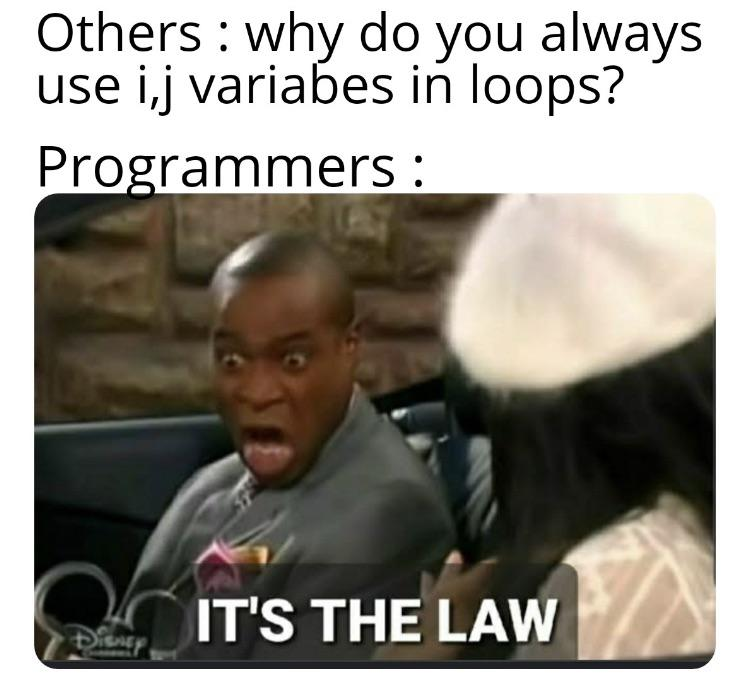

# S.O.L.I.D

An extensive guide on the solid principles as part of a BeCode exercise.

| PRINCIPLE |                                                                                                                                  |
| --------- | -------------------------------------------------------------------------------------------------------------------------------- |
|           | A fundamental truth or proposition that serves as the foundation for a system of belief or behaviour or for a chain or reasoning |
|           | A general scientific theorem or law that has numerous special applications across a wide field                                   |
|           | A fundamental source or basis of something                                                                                       |

`Principles are not rules, but general ideas that should govern your idea of right vs wrong`

I and J are often used in for loops. tough any name can be used. it's principaly correct to use I within your loop to keep it readable for those following the same principles. With a good argument for it it's completely fine to use a different variable name.

| Letter | Principle             | Description                                                                                | Defenition                                                                                                                             |
| ------ | --------------------- | ------------------------------------------------------------------------------------------ | -------------------------------------------------------------------------------------------------------------------------------------- |
| S      | Single-Responsibility | A class,method,function has one specific job                                               |
| O      | Open-Closed           | An object should be open for exntension, but closed for modification                       |
| L      | Liskov Substitution   | Every subclass or derived class should be substitutable for their base or parent class     | Let Φ(x) be a property provable about objects x of type T. Then Φ(y) should be true for objects y of type S where S is a subtype of T. |
| I      | Interface Segregation | One should never be forced to implement methods they do not use.                           |
| D      | Dependency Inversion  | A class's dependencies should be open for change without having to change the class itself | Depend on abstracts, not concretes                                                                                                     |

## Explain it to me like I'm 5

- #### S - Single responsibility
  - Doing one thing at a time makes you more at ease, does it not ?
- #### O - Open/Closed
  - I should be able to build upon what you created, but not change your creation
- #### L - Liskov's Substitution
  - When you build a 3 story house, I should be able to swap two floors without the house crumbling down
- #### I - Interface Segregation
  - Rules are good, but you should not have to follow rules that do not apply to you
- #### D - Dependency Inversion
  - You should still be able to come out and play if you wear different shoes

## Explain it to me like I'm 10

- #### S - Single responsibility
  -
- #### O - Open/Closed
  -
- #### L - Liskov's Substitution
  -
- #### I - Interface Segregation
  -
- #### D - Dependency Inversion
  -

## Explain it to me like I'm 15

- #### S - Single responsibility
  -
- #### O - Open/Closed
  -
- #### L - Liskov's Substitution
  -
- #### I - Interface Segregation
  -
- #### D - Dependency Inversion
  -

## Explain it to me like I'm 20

- #### S - Single responsibility
  -
- #### O - Open/Closed
  -
- #### L - Liskov's Substitution
  -
- #### I - Interface Segregation
  -
- #### D - Dependency Inversion
  -

## Explain it to me like I'm 80

Your generation 'gave' us the mother of all programming languages. If you are 80 and reading this. Go have some fun! You deserve it!

If you are 80 and still reading this. I am sorry master senpai programmer. I am trying tough, But I still tend to layer my complications on top of the simplicity of a binary library.

## My Road trough the BeCode exercise

In every repository I kept the original typescript, and created a new.ts to apply my changes.

### S - Single Responsibility

- Underscore naming convention (hey! another principle :D )
  - It seems that there is a lot of hate for this convention when looking it up. I am guessing it's a principle taught to beginners to avoid issues when naming getters and setters.
  - It seems like this naming convention is bound to change depending on the team you work with.
  - This seems like a nice convention to ease make workign with typescript easier but there are some nice alternatives to this as found in the microsoft or google styleguides for typescript
  - Google's take:
    `If an accessor is used to hide a class property, the hidden property may be prefixed or suffixed with any whole word, like internal or wrapped. When using these private properties, access the value through the accessor whenever possible. At least one accessor for a property must be non-trivial: do not define pass-through accessors only for the purpose of hiding a property. Instead, make the property public (or consider making it readonly rather than just defining a getter with no setter).`
  - **Concluding** : the \_ prefix is not a good principle,but it works since it is destructive to the readability of the code. Tough it does make naming getters and setters easier. It's probably one of the first things to update (since it's an outdated principle) once the use and understanding of typescript becomes more natural.
